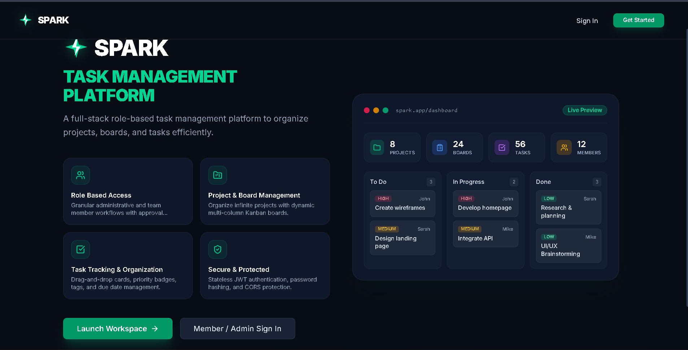

# ⚡ SPARK – Smart Project and Task Management Platform

SPARK is a **full-stack role-based task and project management platform** inspired by Trello that enables teams to organize projects and tasks efficiently using interactive Kanban-style boards.



---

## 🚀 Key Features

- **⚡ Modern Dark-Navy & Emerald Design**: Sleek, responsive, and dynamic UI built with Tailwind CSS & Framer Motion.
- **📋 Interactive Kanban Board**: Real-time drag-and-drop task progression across **To Do**, **In Progress**, and **Done** columns.
- **👥 Role-Based Access Control (RBAC)**: Distinct dashboards and authorization guards for **Admin** and **Member** roles with approval moderation.
- **📊 Analytics & Overview**: Visual donut charts and metrics for completed, in-progress, and pending tasks.
- **🏷️ Rich Task Attributes**: Priority badges (*High*, *Medium*, *Low*), assignees, tags, descriptions, and due dates.
- **🛡️ Secure Authentication**: JWT stateless authentication, bcrypt password hashing, and dynamic CORS origin protection.

---

## 🛠️ Tech Stack

| Layer | Technology |
|---|---|
| **Frontend** | React.js (Vite), Tailwind CSS, Framer Motion, Recharts, Zustand, Lucide Icons |
| **Backend** | Node.js, Express.js |
| **Database** | MongoDB (Mongoose) |
| **Authentication** | JSON Web Tokens (JWT), Bcrypt.js |
| **API Client** | Axios |

---

## 📂 Project Structure

```text
SPARK-Smart-Project-and-Task-Management-Platform
├── backend
│   ├── config/          # MongoDB database connection
│   ├── middleware/      # JWT auth & RBAC role guards
│   ├── models/          # User, Project, Task, Board Mongoose schemas
│   ├── routes/          # Express API endpoints
│   └── server.js        # Express app entry point
│
├── frontend
│   ├── src/
│   │   ├── api/         # Axios instance with auth interceptor
│   │   ├── components/  # Layout, Navbar, Sidebar, Badges, Buttons, Modals
│   │   ├── context/     # Zustand authentication store
│   │   ├── pages/       # Home, Login, Register, Dashboards, Projects, Tasks
│   │   ├── App.jsx      # React router & protected routes
│   │   └── main.jsx     # Vite client entry point
│   ├── tailwind.config.js
│   └── vite.config.js
│
├── spark.png            # Platform preview screenshot
└── README.md
```

---

## ⚙️ Installation & Setup

### 1. Clone the repository
```bash
git clone https://github.com/bhosalesunil/SPARK-Smart-Project-and-Task-Management-Platform.git
cd SPARK-Smart-Project-and-Task-Management-Platform
```

### 2. Backend Setup
```bash
cd backend
npm install
```

Create a `.env` file in the `backend/` directory:
```env
PORT=5000
MONGO_URI=mongodb://localhost:27017/trello_clone
JWT_SECRET=your_jwt_secret_key
CORS_ORIGIN=http://localhost:5173,http://localhost:5174,http://localhost:3000
ALLOW_ADMIN_REGISTRATION=true
```

Start the backend server:
```bash
node server.js
```

### 3. Frontend Setup
```bash
cd ../frontend
npm install
```

Start the Vite development server:
```bash
npm run dev
```

Open [http://localhost:5174](http://localhost:5174) in your browser.

---

## 🔌 API Endpoints Summary

| Method | Endpoint | Description | Access |
|---|---|---|---|
| `POST` | `/api/auth/register` | Register a new user | Public |
| `POST` | `/api/auth/login` | Authenticate user & get JWT | Public |
| `GET` | `/api/admin/dashboard` | Aggregated administrative statistics | Admin |
| `GET` | `/api/users/pending` | List pending registrations | Admin |
| `PUT` | `/api/users/:id/approve` | Approve user registration & assign role | Admin |
| `GET` | `/api/projects` | Get all projects | Authenticated |
| `POST` | `/api/projects` | Create a new project & initialize board | Admin |
| `GET` | `/api/boards/:projectId` | Fetch project Kanban board | Authenticated |
| `PUT` | `/api/boards/:projectId` | Update board cards and column positions | Authenticated |
| `GET` | `/api/tasks` | Get all tasks | Authenticated |
| `POST` | `/api/tasks` | Create task | Admin |
| `PUT` | `/api/tasks/:id` | Update task status or details | Authenticated |
| `GET` | `/api/member/dashboard` | Member specific task breakdown | Member |

---

## 👤 Author

**Sunil Bhosale**
- **GitHub**: [@bhosalesunil](https://github.com/bhosalesunil)
- **Repository**: [SPARK-Smart-Project-and-Task-Management-Platform](https://github.com/bhosalesunil/SPARK-Smart-Project-and-Task-Management-Platform)
